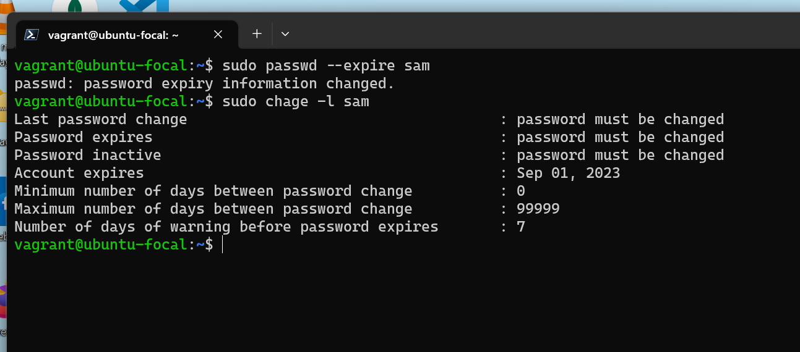

# Alt School Africa - User Permission (Solution)

This is a solution to the Alt school (Cloud Engineering) Assignment. The Assignment is aimed at helping students better understand User and Group permission in Linix.

## Table of contents

- [Create A User](#create-user)
  - [Set Expiry Date of 2 weeks](#set-expiry-date)
  - [Prompt To Change Password On Login](#prompt-to-change-password)
  - [Attach To AltSchool Group](#attach-to-altschool-group)
- [Create AltSchool Group](#create-altschool-group)
  - [Allow AltSchool Group Run Only CAT Command On /etc/](#allow-altschool-group-run-only-cat-command-on-etc)
  - [Run CAT Command On A File In /etc Directory Using A Member Of The Alt School Group](#run-cat-command-a-file-in-etc-directory)
- [Create Another User](#create-another-user)
  - [User Must Not Have A Home Directory](#user-must-not-have-a-home-directory)

## Create User

The `useradd` or `adduser` command can be use to create a new user in linux. In the image below I used the `useradd` command to create a new user **sam**.

### Set Expiry Date

The `chage` command can be use to set or change expiry date for a user account or user account password in linux. In the image below I used the `chage` command to set a expiry date of two weeks for the new user **sam**.

### Prompt To Change Password

The `passwd` command can be use to set or change user password, and other password related settings in linux. Using the `--expire` or `-e` flag with the `passwd` sets the user account password to expire immediately, therefore forcing the user to change their password when next they log in. In the image below I used the `passwd` command with the `--expire` to set the new user **sam** password to expire immediately.

### Attach To AltSchool Group

The `usermod` command can be used to modify user account properties in linux. Using the `-aG` flag with the `usermod` command adds the specified user to the specified group. In the image below I used the `usermod` command with the `-aG` to add the new user **sam** to the group **altschool**.

## Create AltSchool Group

The `groupadd` command can be use to create a new group in linux. In the image below I used the `groupadd` command to create a new group **altschool**.

### Allow AltSchool Group Run Only CAT Command On etc

To allow altschool group cat command privileges. We need to open the sudoers file and add an entry for altschool allowing it's members to run cat commands on files within the `/etc` directory. The `visudo` command allow a us to safely edit the sudoers file. Adding this `%alt ALL=(ALL) /bin/cat /etc/*` command to the sudoers file allows the new group **altschool** the cat command privileges.

### Run Cat Command A File In ETC Directory

Switching to the new user **sam**. Since user **sam** is a member of the **altschool** group. It has the privilege to run cat command on the files in etc directory. In the image below is an example of running cat command on a file in the etc directory using user **sam**

## Create Another User

### User Must Not Have A Home Directory

Adding the `-M` flag to the `useradd` command when creating a user. creates the user with out a home directory.

## Author

- Twitter - [@samdevtech](https://www.twitter.com/samdevtech)
